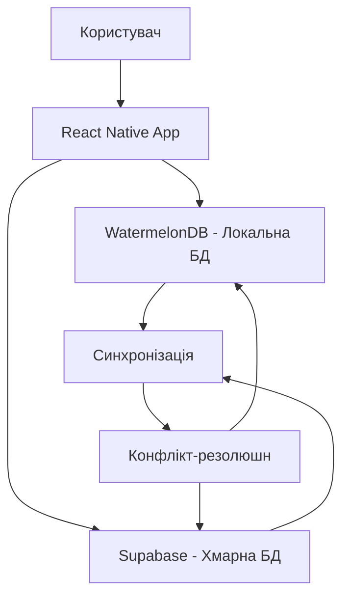

# Розрахуй і В'яжи - Mobile App


> Mobile-first додаток з підтримкою офлайн-режиму для майстрів в'язання

## 🎉 Статус проєкту

✅ **OneSignal інтегровано** | 🚀 **Готово до розробки** | 📱 **Android тестування** | 🔐 **Безпечна авторизація**

**Player ID для тестування:** `3d417f40-a71e-4709-9829-6af78376ef77`

Мобільний додаток для майстрів в'язання з підтримкою офлайн-режиму, розроблений на React Native (Expo) та Supabase з архітектурою offline-first та турбо-синхронізацією даних.

## 📱 Огляд

"Розрахуй і В'яжи" - це інструмент, який допомагає майстрам в'язання з розрахунками, веденням проєктів, обліком пряжі та спілкуванням у спільноті. Ключовою особливістю є offline-first архітектура, що забезпечує доступ до даних навіть без інтернет-з'єднання.

## 🛠️ Технічний стек

### Клієнт:
- **React Native (Expo)**: Фреймворк для розробки кросплатформенних мобільних додатків.
- **TypeScript**: Типізована надбудова над JavaScript для підвищення надійності коду.
- **WatermelonDB**: Локальна база даних, оптимізована для React Native, забезпечує offline-first функціональність.
- **TailwindCSS (NativeWind)**: Утилітарний CSS-фреймворк для швидкого створення інтерфейсів.
- **React Navigation**: Бібліотека для навігації між екранами додатку.

### Сервер:
- **Supabase**: Open-source альтернатива Firebase, що надає:
    - **PostgreSQL**: Реляційна база даних з підтримкою JSONB.
    - **Auth**: Система автентифікації користувачів.
    - **Storage**: Сховище для файлів (зображення, схеми тощо).
    - **Edge Functions**: Безсерверні функції для виконання логіки на стороні сервера (наприклад, калькулятори).
    - **Realtime**: Можливість підписки на зміни в базі даних у реальному часі.

### Push-сповіщення:
- **OneSignal SDK 5.x**: ✅ **Повністю інтегровано** - система push-сповіщень
- **Expo Notifications**: Локальні сповіщення та дозволи

### Додатково:
- **Wayforpay**: Платіжна система (планується інтеграція).
- **Next.js**: Фреймворк для створення адмін-панелі (планується).

## 🗂️ Детальна структура проєкту

```
expo-supabase-starter/
├── 📄 .env                          # Змінні середовища (не включено до репозиторію)
├── 📄 .env.example                  # Приклад змінних середовища
├── 📄 app.config.js                 # Конфігурація Expo (OneSignal, EAS)
├── 📄 app.json                      # Конфігурація додатку та плагінів
├── 📄 eas.json                      # Конфігурація EAS Build (збірки)
├── 📄 package.json                  # Залежності та скрипти проєкту
├── 📄 tailwind.config.js            # Конфігурація TailwindCSS/NativeWind
├── 📄 tsconfig.json                 # Конфігурація TypeScript
├── 📄 metro.config.js               # Конфігурація Metro Bundler
├── 📄 babel.config.js               # Конфігурація Babel
├── 📄 eslint.config.js              # Конфігурація ESLint
├── 📄 .prettierrc                   # Конфігурація Prettier
├── 📄 components.json               # Конфігурація UI компонентів
├── 📄 nativewind-env.d.ts           # TypeScript типи для NativeWind
├── 📄 expo-env.d.ts                 # TypeScript типи для Expo
├── 📄 global.css                    # Глобальні стилі TailwindCSS
│
├── 📁 app/                          # 🛤️ Екрани та маршрути (Expo Router v5)
│   ├── 📁 (protected)/              # 🔒 Захищені маршрути (потребують авторизації)
│   │   ├── 📁 (tabs)/               # 📱 Вкладки основного додатку
│   │   │   ├── 📄 _layout.tsx       # Розмітка навігації по вкладках (Tab Navigator)
│   │   │   ├── 📄 index.tsx         # 🏠 Головний екран (Дашборд)
│   │   │   └── 📄 settings.tsx      # ⚙️ Екран налаштувань користувача
│   │   ├── 📄 _layout.tsx           # Розмітка захищеної зони (перевірка авторизації)
│   │   └── 📄 modal.tsx             # 📋 Модальне вікно (приклад)
│   ├── 📄 _layout.tsx               # 🎨 Головна розмітка додатку (Root Layout)
│   ├── 📄 sign-in.tsx               # 🔑 Екран входу в систему
│   ├── 📄 sign-up.tsx               # 📝 Екран реєстрації нового користувача
│   ├── 📄 welcome.tsx               # 👋 Вітальний екран для нових користувачів
│   └── 📄 +not-found.tsx            # ❌ Екран 404 (не знайдено)
│
├── 📁 assets/                       # 🖼️ Статичні ресурси
│   ├── 📄 icon.png                  # Іконка додатку
│   ├── 📄 splash.png                # Заставка додатку
│   ├── 📄 adaptive-icon.png         # Адаптивна іконка (Android)
│   └── 📄 favicon.png               # Favicon для веб-версії
│
├── 📁 components/                   # 🧩 Перевикористовувані компоненти
│   ├── 📁 ui/                       # 🎨 UI компоненти (Design System)
│   │   ├── 📄 button.tsx            # Компонент кнопки з варіантами стилів
│   │   ├── 📄 form.tsx              # Компоненти форм (Field, Error, Label)
│   │   ├── 📄 input.tsx             # Компонент поля вводу тексту
│   │   ├── 📄 label.tsx             # Компонент мітки для форм
│   │   ├── 📄 radio-group.tsx       # Компонент групи радіокнопок
│   │   ├── 📄 switch.tsx            # Компонент перемикача (toggle)
│   │   ├── 📄 text.tsx              # Компонент тексту з типографією
│   │   ├── 📄 textarea.tsx          # Компонент багаторядкового тексту
│   │   └── 📄 typography.tsx        # Типографічні компоненти (H1, H2, P)
│   ├── 📄 image.tsx                 # Оптимізований компонент зображень
│   └── 📄 safe-area-view.tsx        # Компонент безпечних зон екрану
│
├── 📁 config/                       # ⚙️ Конфігураційні файли
│   └── 📄 supabase.ts               # Конфігурація Supabase з шифруванням даних
│
├── 📁 constants/                    # 🎯 Константи додатку
│   └── 📄 colors.ts                 # Кольорова палітра проєкту
│
├── 📁 context/                      # 🌐 React контексти
│   └── 📄 supabase-provider.tsx     # Провайдер автентифікації Supabase
│
├── 📁 hooks/                        # 🪝 Кастомні React хуки
│   └── 📄 useNotifications.ts       # ✅ OneSignal інтеграція (повністю працює)
│
├── 📁 lib/                          # 📚 Бібліотеки та утиліти
│   ├── 📄 supabaseClient.ts         # Клієнт Supabase з налаштуваннями
│   ├── 📄 useColorScheme.ts         # Хук для роботи з темною/світлою темою
│   └── 📄 utils.ts                  # Утиліти (cn для класів, валідація)
│
├── 📁 scripts/                      # 🔧 Скрипти автоматизації
│   └── 📄 generate-colors.js        # Генерація кольорових констант
│
├── 📁 types/                        # 🏷️ TypeScript типи
│   └── 📄 database.types.ts         # Типи бази даних Supabase (автогенерація)
│
├── 📁 services/                     # 🌐 Сервіси та API
│   └── 📄 api.ts                    # API методи для взаємодії з сервером
│
├── 📁 docs/                         # 📖 Документація проєкту
│   ├── 📄 architecture.md           # Архітектура системи
│   ├── 📄 deployment.md             # Інструкції з розгортання
│   └── 📄 development.md            # Посібник для розробників
│
├── 📁 .expo/                        # Expo метадані (автогенерація)
├── 📁 .git/                         # Git репозиторій
├── 📁 .idea/                        # IntelliJ IDEA налаштування
├── 📁 .memex/                       # Memex AI асистент правила
├── 📁 android/                      # Android нативний код (EAS Build)
└── 📁 node_modules/                 # Залежності Node.js
```

### 🎯 Детальний опис ключових файлів

#### **🛤️ Маршрутизація та навігація (Expo Router v5)**

##### `app/_layout.tsx` - **Root Layout**
```typescript
// Головна розмітка додатку з провайдерами
export default function RootLayout() {
  return (
    <AuthProvider>           // Суpabase автентифікація  
      <ThemeProvider>        // Тема (світла/темна)
        <Stack />            // Навігаційний стек
      </ThemeProvider>
    </AuthProvider>
  );
}
```
**Призначення:** Ініціалізація глобального стану, провайдерів та системи навігації

##### `app/(protected)/_layout.tsx` - **Authentication Guard** 
```typescript
// Захист маршрутів від неавторизованих користувачів
export default function ProtectedLayout() {
  const { session } = useAuth();
  
  if (!session) {
    return <Redirect href="/welcome" />;  // Перенаправлення на вітальний екран
  }
  
  return <Stack />;  // Рендеринг захищених маршрутів
}
```
**Призначення:** Перевірка авторизації, захист приватних маршрутів

##### `app/(protected)/(tabs)/_layout.tsx` - **Tab Navigation**
```typescript
// Конфігурація нижньої навігації з вкладками
export default function TabLayout() {
  return (
    <Tabs
      screenOptions={{
        tabBarStyle: { backgroundColor: colors.background },
        headerShown: false,
      }}
    >
      <Tabs.Screen name="index" options={{ title: "Головна" }} />
      <Tabs.Screen name="settings" options={{ title: "Налаштування" }} />
    </Tabs>
  );
}
```
**Призначення:** Основна навігація додатку з вкладками

#### **🔐 Автентифікація та безпека**

##### `context/supabase-provider.tsx` - **Auth Provider**
```typescript
interface AuthContextType {
  session: Session | null;      // Поточна сесія користувача
  initialized: boolean;         // Чи ініціалізована система авторизації
  signUp: (email: string, password: string) => Promise<AuthResponse>;
  signIn: (email: string, password: string) => Promise<AuthResponse>;
  signOut: () => Promise<void>;
}

export function AuthProvider({ children }: PropsWithChildren) {
  // Стан автентифікації
  const [session, setSession] = useState<Session | null>(null);
  const [initialized, setInitialized] = useState(false);
  
  // Ініціалізація сесії при запуску
  useEffect(() => {
    supabase.auth.getSession().then(({ data: { session } }) => {
      setSession(session);
      setInitialized(true);
    });
    
    // Відстеження змін стану авторизації
    const { data: { subscription } } = supabase.auth.onAuthStateChange(
      (_event, session) => setSession(session)
    );
    
    return () => subscription.unsubscribe();
  }, []);
  
  // Навігація на основі стану авторизації
  useEffect(() => {
    if (initialized) {
      if (session) {
        router.replace("/");           // Авторизований → головна
      } else {
        router.replace("/welcome");    // Не авторизований → вітальний екран
      }
    }
  }, [initialized, session]);
}
```
**Призначення:** Централізоване управління автентифікацією та станом користувача

##### `config/supabase.ts` - **Secure Storage з шифруванням**
```typescript
class LargeSecureStore {
  // Шифрування AES перед зберіганням
  private async _encrypt(key: string, value: string) {
    const encryptionKey = crypto.getRandomValues(new Uint8Array(256 / 8));
    const cipher = new aesjs.ModeOfOperation.ctr(encryptionKey, new aesjs.Counter(1));
    const encryptedBytes = cipher.encrypt(aesjs.utils.utf8.toBytes(value));
    
    // Зберігаємо ключ шифрування в SecureStore
    await SecureStore.setItemAsync(key, aesjs.utils.hex.fromBytes(encryptionKey));
    return aesjs.utils.hex.fromBytes(encryptedBytes);
  }
  
  // Розшифрування при отриманні
  private async _decrypt(key: string, value: string) {
    const encryptionKeyHex = await SecureStore.getItemAsync(key);
    const cipher = new aesjs.ModeOfOperation.ctr(
      aesjs.utils.hex.toBytes(encryptionKeyHex),
      new aesjs.Counter(1)
    );
    const decryptedBytes = cipher.decrypt(aesjs.utils.hex.toBytes(value));
    return aesjs.utils.utf8.fromBytes(decryptedBytes);
  }
  
  // AsyncStorage-сумісний інтерфейс з шифруванням
  async setItem(key: string, value: string) {
    const encrypted = await this._encrypt(key, value);
    await AsyncStorage.setItem(key, encrypted);
  }
}

// Supabase клієнт з обмеженнями для безпеки
export const supabase = createClient(supabaseUrl, supabaseAnonKey, {
  auth: {
    storage: new LargeSecureStore(),    // Захищене сховище
    autoRefreshToken: true,             // Автооновлення токенів
    persistSession: true,               // Збереження сесії
    detectSessionInUrl: false,          // Безпека: не читати з URL
  },
});

// Оптимізація: обмежити оновлення токенів тільки при активному додатку
AppState.addEventListener('change', (state) => {
  if (state === 'active') {
    supabase.auth.startAutoRefresh();
  } else {
    supabase.auth.stopAutoRefresh();
  }
});
```
**Призначення:** Безпечне зберігання токенів з AES шифруванням та оптимізацією для мобільних пристроїв

#### **🎨 UI система та дизайн**

##### `components/ui/button.tsx` - **Варіативний компонент кнопки**
```typescript
const buttonVariants = cva("items-center justify-center rounded-md", {
  variants: {
    variant: {
      default: "bg-primary text-primary-foreground",
      destructive: "bg-destructive text-destructive-foreground",
      outline: "border border-input bg-background",
      secondary: "bg-secondary text-secondary-foreground",
      ghost: "hover:bg-accent hover:text-accent-foreground",
      link: "text-primary underline-offset-4",
    },
    size: {
      default: "h-10 px-4 py-2",
      sm: "h-9 rounded-md px-3",
      lg: "h-11 rounded-md px-8",
      icon: "h-10 w-10",
    },
  },
  defaultVariants: { variant: "default", size: "default" },
});

interface ButtonProps extends TouchableOpacityProps {
  variant?: "default" | "destructive" | "outline" | "secondary" | "ghost" | "link";
  size?: "default" | "sm" | "lg" | "icon";
  className?: string;
}
```
**Призначення:** Систематизовані кнопки з варіантами стилів для консистентного дизайну

##### `components/ui/form.tsx` - **Компоненти форм з валідацією**
```typescript
// React Hook Form + Zod інтеграція
const FormField = React.forwardRef<ElementRef<typeof Slot>, FormFieldProps>(
  ({ ...props }, ref) => {
    return (
      <FormFieldContext.Provider value={{ name: props.name }}>
        <Controller {...props} />
      </FormFieldContext.Provider>
    );
  }
);

// Автоматичне відображення помилок валідації
const FormMessage = React.forwardRef<ElementRef<typeof Text>, FormMessageProps>(
  ({ className, children, ...props }, ref) => {
    const { error, formMessageId } = useFormField();
    const body = error ? String(error?.message) : children;
    
    if (!body) return null;
    
    return (
      <Text
        ref={ref}
        nativeID={formMessageId}
        className={cn("text-sm font-medium text-destructive", className)}
        {...props}
      >
        {body}
      </Text>
    );
  }
);
```
**Призначення:** Повна інтеграція з React Hook Form для валідованих форм

#### **🔔 Push-сповіщення (OneSignal 5.x)**

##### `hooks/useNotifications.ts` - **OneSignal Integration**
```typescript
export function useNotifications() {
  const [isInitialized, setIsInitialized] = useState(false);
  
  useEffect(() => {
    const initializeOneSignal = async () => {
      const isNativePlatform = Platform.OS === 'android' || Platform.OS === 'ios';
      
      if (isNativePlatform && OneSignal) {
        const appId = "064a7314-cd39-49f2-acb8-391e8446bc38";
        
        // Ініціалізація OneSignal 5.x
        await OneSignal.initialize(appId);
        
        // Event Listeners для OneSignal 5.x API
        OneSignal.Notifications.addEventListener('foregroundWillDisplay', (event) => {
          console.log('📬 Отримано сповіщення:', event.notification.title);
        });
        
        OneSignal.Notifications.addEventListener('click', (event) => {
          console.log('👆 Натиснуто на сповіщення:', event.notification.title);
          // Навігація на основі даних сповіщення
        });
        
        // Запит дозволів
        const permission = await OneSignal.Notifications.requestPermission(true);
        console.log('🔔 Дозвіл на сповіщення:', permission);
        
        setIsInitialized(true);
      }
    };
    
    initializeOneSignal();
  }, []);
  
  return {
    isAvailable: isInitialized,
    requestPermission: async () => {
      const permission = await OneSignal.Notifications.requestPermission(true);
      return permission;
    },
    sendTag: (key: string, value: string) => {
      OneSignal.User.addTag(key, value);
    },
    identifyUser: (userId: string) => {
      OneSignal.User.addAlias("user_id", userId);
    },
    logoutUser: () => {
      OneSignal.User.removeAlias("user_id");
    },
  };
}
```
**Призначення:** Повна інтеграція з OneSignal 5.x для push-сповіщень з підтримкою тегів та користувацької ідентифікації

## 🚀 Швидкий старт

### 📋 Передумови

**Обов'язкові інструменти:**
- **Node.js** >= 18.0.0 (рекомендовано LTS)
- **Yarn** >= 1.22.0 або **npm** >= 8.0.0  
- **Expo CLI** >= 6.0.0: `npm install -g @expo/cli`

**Для розробки:**
- **Android Studio** (для Android емулятора)
- **Xcode** >= 14.0 (для iOS емулятора, тільки на macOS)
- **EAS CLI** для збірок: `npm install -g eas-cli`

**Обліки сервісів:**
- [Supabase](https://supabase.com) - Backend та база даних
- [OneSignal](https://onesignal.com) - Push-сповіщення  
- [Expo](https://expo.dev) - Платформа розробки

### ⚙️ Детальне налаштування

#### 1. **Підготовка проєкту**
```bash
# Клонування репозиторію
git clone https://github.com/your-username/expo-supabase-starter.git
cd expo-supabase-starter

# Встановлення залежностей
yarn install

# Очищення кешу (при необхідності)
yarn start --clear
```

#### 2. **Конфігурація змінних середовища**

Створіть файл `.env` на основі `.env.example`:

```env
# Supabase конфігурація
EXPO_PUBLIC_SUPABASE_URL="https://your-project.supabase.co"
EXPO_PUBLIC_SUPABASE_ANON_KEY="your-anon-key-here"

# OneSignal конфігурація  
EXPO_PUBLIC_ONESIGNAL_APP_ID="your-onesignal-app-id"

# Додаткові налаштування (опціонально)
EXPO_PUBLIC_ENVIRONMENT="development"
EXPO_PUBLIC_API_URL="https://api.example.com"
```

**Як отримати ключі:**

**Supabase:**
1. Створіть новий проєкт на [supabase.com](https://supabase.com)
2. Перейдіть до Settings → API
3. Скопіюйте `URL` та `anon public` ключ

**OneSignal:**
1. Створіть додаток на [onesignal.com](https://onesignal.com)
2. Platform Settings → Native Android/iOS
3. Скопіюйте `App ID` з Settings → Keys & IDs

#### 3. **Налаштування EAS Build**
```bash
# Вхід в обліковий запис Expo
eas login

# Конфігурація збірки (автоматично створить eas.json)
eas build:configure

# Налаштування проєкту (якщо потрібно)
eas project:init
```

#### 4. **Запуск проєкту**

**Режим розробки:**
```bash
# Запуск Metro bundler
yarn start

# Альтернативні команди
yarn web          # Веб-версія
yarn android      # Android (потребує емулятор/пристрій)
yarn ios          # iOS (тільки на macOS)
```

**Тестування на пристроях:**
- Встановіть **Expo Go** на мобільний пристрій
- Відскануйте QR-код з терміналу
- Або використовуйте емулятори Android Studio/iOS Simulator

### 🏗️ Розгортання та збірка

#### **Development Build (для тестування)**
```bash
# Створення тестової збірки для Android  
eas build --platform android --profile development

# Для iOS (потребує Apple Developer Account)
eas build --platform ios --profile development

# Встановлення на пристрій через EAS
eas device:create  # Реєстрація пристрою
eas build --platform android --profile development
```

#### **Production Build**
```bash
# Продакшн збірка для Google Play Store
eas build --platform android --profile production

# Продакшн збірка для App Store
eas build --platform ios --profile production

# Автоматичне надсилання до магазинів
eas submit --platform android
eas submit --platform ios
```

#### **Конфігурація збірок в `eas.json`**
```json
{
  "build": {
    "development": {
      "developmentClient": true,
      "distribution": "internal",
      "env": {
        "EXPO_PUBLIC_SUPABASE_URL": "https://your-dev-supabase.co",
        "EXPO_PUBLIC_ONESIGNAL_APP_ID": "dev-app-id"
      }
    },
    "production": {
      "env": {
        "EXPO_PUBLIC_SUPABASE_URL": "https://your-prod-supabase.co", 
        "EXPO_PUBLIC_ONESIGNAL_APP_ID": "prod-app-id"
      }
    }
  }
}
```

### 🔧 Команди розробки

```bash
# Основні команди
yarn start                    # Запуск Metro bundler
yarn start --clear            # З очищенням кешу
yarn android                  # Запуск на Android
yarn ios                      # Запуск на iOS
yarn web                      # Веб-версія

# Якість коду
yarn lint                     # ESLint перевірка
yarn lint --fix               # Автоматичне виправлення
yarn generate-colors         # Генерація кольорових констант

# EAS команди
eas build --platform android --profile development    # Тестова збірка
eas build --platform android --profile production     # Продакшн збірка
eas update                    # OTA оновлення
eas device:list               # Список зареєстрованих пристроїв

# Git workflow
git add .
git commit -m "feat: опис змін 🤖 Generated with Memex"
git push origin main
```

### 🐛 Вирішення проблем

**Проблема з Metro bundler:**
```bash
# Очищення всіх кешів
yarn start --clear
npx expo start --clear

# Повна переустановка
rm -rf node_modules yarn.lock
yarn install
```

**Проблема з OneSignal:**
```bash
# Перевірка логів
adb logcat | grep OneSignal           # Android
# Або перегляньте логи в Expo

# Переконайтеся що OneSignal App ID правильний
echo $EXPO_PUBLIC_ONESIGNAL_APP_ID
```

**Проблема з Supabase:**
```bash
# Перевірка з'єднання
curl -H "apikey: YOUR_ANON_KEY" "YOUR_SUPABASE_URL/rest/v1/"

# Перевірка змінних
echo $EXPO_PUBLIC_SUPABASE_URL
echo $EXPO_PUBLIC_SUPABASE_ANON_KEY
```

## 🏛️ Архітектура додатку

### 🎯 Ключові архітектурні принципи

#### **1. Offline-First Architecture**
Додаток розроблено з пріоритетом роботи в офлайн-режимі:



#### **2. Триступенева система зберігання**

```typescript
// Рівень 1: Оперативна пам'ять (React State)
const [projects, setProjects] = useState<Project[]>([]);

// Рівень 2: Локальна база (WatermelonDB) - ПЛАНУЄТЬСЯ
import { Database } from '@nozbe/watermelondb';
import { synchronize } from '@nozbe/watermelondb/sync';

// Рівень 3: Хмарна база (Supabase)
const { data } = await supabase.from('projects').select('*');
```

#### **3. Синхронізація даних (WatermelonDB + Supabase)**

**Турбо-синхронізація з диференційними оновленнями:**

```typescript
// services/sync.ts - ПЛАНУЄТЬСЯ РОЗРОБКА
export class DataSyncService {
  // Витягування змін з сервера
  async pullChanges(lastPulledAt?: number): Promise<SyncPullResult> {
    const response = await supabase.rpc('pull_changes', {
      last_pulled_at: lastPulledAt,
      user_id: userId
    });
    
    return {
      changes: response.data.changes,
      timestamp: response.data.timestamp,
    };
  }
  
  // Відправка локальних змін на сервер
  async pushChanges(changes: LocalChange[]): Promise<SyncPushResult> {
    const response = await supabase.rpc('push_changes', {
      changes: changes,
      user_id: userId
    });
    
    return {
      conflicts: response.data.conflicts,
      resolved: response.data.resolved,
    };
  }
  
  // Вирішення конфліктів (Last-Write-Wins)
  async resolveConflicts(conflicts: Conflict[]) {
    return conflicts.map(conflict => ({
      id: conflict.id,
      resolution: conflict.serverVersion.updated_at > conflict.localVersion.updated_at 
        ? 'server' : 'local'
    }));
  }
}
```

### 🔐 Безпека та автентифікація

#### **Багаторівнева система безпеки:**

```typescript
// 1. Клієнтська безпека (config/supabase.ts)
class SecureAuthStorage {
  // AES-256 шифрування токенів
  private encryptToken(token: string): string {
    const key = crypto.getRandomValues(new Uint8Array(32));
    const cipher = new aesjs.ModeOfOperation.ctr(key, new aesjs.Counter(1));
    return aesjs.utils.hex.fromBytes(cipher.encrypt(aesjs.utils.utf8.toBytes(token)));
  }
  
  // Зберігання в Expo SecureStore
  async storeSecureToken(key: string, token: string) {
    const encrypted = this.encryptToken(token);
    await SecureStore.setItemAsync(key, encrypted);
  }
}

// 2. Серверна безпека (Supabase RLS)
-- Row Level Security політики
CREATE POLICY "users_own_projects" ON projects
  FOR ALL USING (auth.uid() = user_id);

CREATE POLICY "users_own_yarn_inventory" ON yarn_inventory  
  FOR ALL USING (auth.uid() = user_id);
```

#### **JWT токени з автоматичним оновленням:**

```typescript
// context/supabase-provider.tsx
export function AuthProvider({ children }: PropsWithChildren) {
  useEffect(() => {
    // Автоматичне оновлення токенів тільки при активному додатку
    const handleAppStateChange = (state: AppStateStatus) => {
      if (state === 'active') {
        supabase.auth.startAutoRefresh();
      } else {
        supabase.auth.stopAutoRefresh();
      }
    };
    
    const subscription = AppState.addEventListener('change', handleAppStateChange);
    return () => subscription?.remove();
  }, []);
}
```

### 📊 Структура даних

#### **Основні сутності системи:**

```typescript
// types/database.types.ts - Типи згенеровані з Supabase
export interface Database {
  public: {
    Tables: {
      // Користувачі та профілі
      profiles: {
        Row: {
          id: string;
          email: string;
          full_name: string | null;
          avatar_url: string | null;
          created_at: string;
          updated_at: string;
        }
      };
      
      // Проєкти в'язання
      projects: {
        Row: {
          id: string;
          user_id: string;
          title: string;
          description: string | null;
          pattern_url: string | null;
          status: 'draft' | 'in_progress' | 'completed' | 'paused';
          yarn_requirements: Json; // JSONB для списку пряжі
          progress_percentage: number;
          created_at: string;
          updated_at: string;
        }
      };
      
      // Склад пряжі
      yarn_inventory: {
        Row: {
          id: string;
          user_id: string;
          brand: string;
          name: string;
          color: string;
          weight_category: 'lace' | 'fingering' | 'dk' | 'worsted' | 'chunky';
          quantity_grams: number;
          cost_per_unit: number | null;
          acquired_date: string | null;
          created_at: string;
          updated_at: string;
        }
      };
      
      // Калькулятори (збережені розрахунки)
      calculations: {
        Row: {
          id: string;
          user_id: string;
          calculator_type: 'yarn_usage' | 'gauge' | 'size_conversion';
          input_data: Json;
          result_data: Json;
          created_at: string;
        }
      };
    }
  }
}
```

### 🔄 Потік даних

#### **Архітектура з управлінням станом:**

```typescript
// 1. UI компонент
const ProjectList = () => {
  const { projects, loading } = useProjects(); // Custom hook
  
  return (
    <FlatList
      data={projects}
      renderItem={({ item }) => <ProjectCard project={item} />}
      refreshing={loading}
      onRefresh={() => syncProjects()}
    />
  );
};

// 2. Custom hook з кешуванням
const useProjects = () => {
  const [projects, setProjects] = useState<Project[]>([]);
  const [loading, setLoading] = useState(false);
  
  // Локальне завантаження (миттєве)
  useEffect(() => {
    loadFromLocal().then(setProjects);
  }, []);
  
  // Фонова синхронізація
  useEffect(() => {
    syncWithServer();
  }, []);
  
  const syncWithServer = async () => {
    try {
      setLoading(true);
      const serverData = await ProjectService.fetchAll();
      setProjects(serverData);
      await ProjectService.saveToLocal(serverData);
    } finally {
      setLoading(false);
    }
  };
  
  return { projects, loading, refresh: syncWithServer };
};

// 3. Service layer
export class ProjectService {
  static async fetchAll(): Promise<Project[]> {
    const { data, error } = await supabase
      .from('projects')
      .select('*')
      .order('updated_at', { ascending: false });
    
    if (error) throw error;
    return data;
  }
  
  static async saveToLocal(projects: Project[]) {
    await AsyncStorage.setItem('projects', JSON.stringify(projects));
  }
  
  static async loadFromLocal(): Promise<Project[]> {
    const stored = await AsyncStorage.getItem('projects');
    return stored ? JSON.parse(stored) : [];
  }
}
```

## 🔐 Безпека

Додаток реалізує наступні заходи безпеки:

1. **Безпечне зберігання токенів**: Використання Expo SecureStore
2. **Шифрування даних**: Шифрування чутливих даних перед зберіганням
3. **Row-Level Security**: Політики безпеки на рівні рядків у Supabase
4. **Автоматичне оновлення токенів**: Реалізовано через Supabase Auth
5. **Моніторинг стану додатку**: Авторефреш токенів тільки коли додаток активний

## 📋 Функціональні області (заплановані)

1. **Управління проєктами в'язання**
   - Створення, редагування та видалення проєктів
   - Відстеження прогресу
   - Зберігання схем і інструкцій

2. **Калькулятори для розрахунків**
   - Розрахунок витрат пряжі
   - Конвертація одиниць вимірювання
   - Калькулятор візерунків

3. **Управління запасами пряжі**
   - Каталогізація наявної пряжі
   - Відстеження використання
   - Нагадування про закінчення матеріалів

4. **Соціальні функції**
   - Публікація завершених робіт
   - Взаємодія з іншими користувачами
   - Обмін схемами і порадами

5. **Офлайн-функціональність**
   - Повний доступ до всіх функцій без інтернету
   - Фонова синхронізація при підключенні

## 🗓️ Дорожня карта розробки (16 етапів)

### **📚 Фаза 1: Фундамент (Етапи 1-4)**

#### **Етап 1: Архітектурна основа** ✅ **ЗАВЕРШЕНО**
- [x] Налаштування Expo проєкту з TypeScript
- [x] Інтеграція Supabase з безпечним зберіганням
- [x] Базова автентифікація (вхід/реєстрація)
- [x] Expo Router v5 з захищеними маршрутами
- [x] OneSignal push-сповіщення

#### **Етап 2: WatermelonDB синхронізація** 🚧 **В РОЗРОБЦІ**
- [ ] Встановлення та конфігурація WatermelonDB
- [ ] Створення схем даних (Projects, YarnInventory, Calculations)
- [ ] Імплементація Pull/Push синхронізації
- [ ] Механізм вирішення конфліктів (Last-Write-Wins)
- [ ] Офлайн-режим з автоматичною синхронізацією

#### **Етап 3: UI/UX система** 🔄 **ЧАСТКОВО**
- [x] Design System з NativeWind
- [x] Базові UI компоненти (Button, Input, Form)
- [ ] Розширені компоненти (Cards, Modals, Tabs)
- [ ] Темна/світла тема
- [ ] Адаптивний дизайн для різних екранів
- [ ] Анімації та transitions

#### **Етап 4: Авторизація та профілі** 🚧 **В РОЗРОБЦІ**
- [x] Базова авторизація через Supabase
- [ ] Профілі користувачів з аватарами
- [ ] Налаштування приватності
- [ ] Біометрична автентифікація (Face ID/Fingerprint)
- [ ] Соціальний логін (Google, Apple, Facebook)

### **🧮 Фаза 2: Основний функціонал (Етапи 5-8)**

#### **Етап 5: Калькулятори в'язання**
- [ ] Калькулятор витрати пряжі
- [ ] Калькулятор розмірів виробу
- [ ] Конвертер одиниць (метричні/імперські)
- [ ] Калькулятор петель та рядів
- [ ] Збереження та історія розрахунків

#### **Етап 6: Управління проєктами**
- [ ] CRUD операції для проєктів
- [ ] Відстеження прогресу (проценти, фото)
- [ ] Прикріплення схем та інструкцій
- [ ] Таймер в'язання
- [ ] Нотатки та коментарі

#### **Етап 7: Склад пряжі**
- [ ] Каталогізація пряжі (бренд, колір, вага)
- [ ] Сканування штрих-кодів
- [ ] Відстеження залишків
- [ ] Планування покупок
- [ ] Оцінка вартості проєктів

#### **Етап 8: Схеми та візерунки**
- [ ] Завантаження та зберігання схем
- [ ] Інтерактивний перегляд PDF
- [ ] Маркування та нотатки на схемах
- [ ] Бібліотека власних візерунків
- [ ] Пошук та фільтрація

### **👥 Фаза 3: Соціальна взаємодія (Етапи 9-12)**

#### **Етап 9: Спільнота майстрів**
- [ ] Стрічка новин з роботами користувачів
- [ ] Система лайків та коментарів
- [ ] Підписки на інших користувачів
- [ ] Групи за інтересами (техніки, стилі)
- [ ] Челенджі та конкурси

#### **Етап 10: Галерея робіт**
- [ ] Публікація завершених проєктів
- [ ] Кілька фото з різних ракурсів
- [ ] Теги та категоризація
- [ ] Детальні описи (час, матеріали, складність)
- [ ] Можливість продажу/обміну

#### **Етап 11: Система сповіщень**
- [ ] Push-сповіщення про активність
- [ ] Нагадування про проєкти
- [ ] Сповіщення про нові схеми
- [ ] Персоналізовані рекомендації
- [ ] Email-дайджести

#### **Етап 12: Чат та комунікація**
- [ ] Особисті повідомлення
- [ ] Групові чати
- [ ] Обмін схемами та порадами
- [ ] Голосові повідомлення
- [ ] Відеодзвінки для навчання

### **💰 Фаза 4: Монетизація та локалізація (Етапи 13-15)**

#### **Етап 13: Система платежів**
- [ ] Інтеграція Wayforpay
- [ ] Преміум підписка
- [ ] Магазин схем та візерунків
- [ ] Віртуальні майстер-класи
- [ ] Платні консультації майстрів

#### **Етап 14: Локалізація**
- [ ] Український інтерфейс
- [ ] Англійська мова
- [ ] Інші європейські мови
- [ ] RTL підтримка (арабська, іврит)
- [ ] Локальні одиниці вимірювання

#### **Етап 15: Тестування та оптимізація**
- [ ] Unit тести для критичних функцій
- [ ] E2E тестування користувацьких сценаріїв
- [ ] Навантажувальне тестування
- [ ] Оптимізація продуктивності
- [ ] A/B тестування UI/UX

### **📊 Фаза 5: Аналітика та адміністрування (Етап 16)**

#### **Етап 16: Адмін-панель та аналітика**
- [ ] Next.js адмін-панель
- [ ] Дашборд з метриками користувачів
- [ ] Модерація контенту
- [ ] Аналітика використання функцій
- [ ] Фінансова звітність
- [ ] Інструменти підтримки користувачів

### **🎯 Поточний статус**

**Завершено (Етап 1):**
- ✅ Базова архітектура додатку
- ✅ Supabase автентифікація з шифруванням
- ✅ OneSignal push-сповіщення
- ✅ Expo Router v5 з захищеними маршрутами
- ✅ UI система з NativeWind

**В розробці (Етап 2-3):**
- 🚧 WatermelonDB інтеграція
- 🚧 Розширена UI система
- 🚧 Профілі користувачів

**Наступні пріоритети:**
1. Завершення WatermelonDB синхронізації
2. Створення калькуляторів в'язання
3. Система управління проєктами

## 🧪 Тестування

### **Автоматизоване тестування**

```bash
# Встановлення залежностей для тестування (планується)
yarn add -D jest @testing-library/react-native detox

# Запуск тестів
yarn test                     # Unit тести
yarn test:e2e                 # End-to-end тестування
yarn test:coverage            # Покриття коду
```

### **Ручне тестування**

#### **Тестування OneSignal**
```bash
# 1. Запустіть додаток
yarn android

# 2. Скопіюйте Player ID з логів консолі
# Приклад: 3d417f40-a71e-4709-9829-6af78376ef77

# 3. Надішліть тестове повідомлення через OneSignal Dashboard:
# - Messages → New Push
# - Audience → Specific Players → вставте Player ID
# - Title: "Тест", Message: "Перевірка push-сповіщень"
```

#### **Тестування автентифікації**
```bash
# Тестові облікові записи
Email: test@example.com
Password: testpassword123

# Або створіть новий обліковий запис через додаток
```

#### **Тестування синхронізації (після реалізації WatermelonDB)**
```bash
# 1. Створіть проєкт офлайн
# 2. Вимкніть інтернет
# 3. Внесіть зміни
# 4. Увімкніть інтернет
# 5. Перевірте синхронізацію
```

### **Performance тестування**

```bash
# Аналіз розміру bundle
npx expo export --dump-sourcemap
npx @expo/metro-bundler-source-map-tools visualize-bundle

# Моніторинг пам'яті
# Використовуйте Chrome DevTools або React DevTools
```

## 🚀 Розгортання та CI/CD

### **EAS Build конфігурація**

```bash
# Початкове налаштування
eas login
eas build:configure
eas project:init

# Розробницькі збірки
eas build --platform android --profile development
eas build --platform ios --profile development

# Продакшн збірки
eas build --platform android --profile production  
eas build --platform ios --profile production

# Автоматичне надсилання до магазинів
eas submit --platform android --latest
eas submit --platform ios --latest
```

### **GitHub Actions CI/CD (планується)**

```yaml
# .github/workflows/ci.yml
name: CI/CD Pipeline

on:
  push:
    branches: [main, develop]
  pull_request:
    branches: [main]

jobs:
  test:
    runs-on: ubuntu-latest
    steps:
      - uses: actions/checkout@v3
      - uses: actions/setup-node@v3
        with:
          node-version: 18
      - run: yarn install
      - run: yarn lint
      - run: yarn test
      
  build:
    needs: test
    runs-on: ubuntu-latest
    if: github.ref == 'refs/heads/main'
    steps:
      - uses: actions/checkout@v3
      - uses: expo/expo-github-action@v8
        with:
          expo-version: latest
          token: ${{ secrets.EXPO_TOKEN }}
      - run: eas build --platform all --non-interactive
```

### **Середовища розгортання**

```javascript
// app.config.js - Конфігурація для різних середовищ
const IS_PRODUCTION = process.env.NODE_ENV === 'production';
const IS_DEVELOPMENT = process.env.EXPO_PUBLIC_ENVIRONMENT === 'development';

export default {
  expo: {
    name: IS_PRODUCTION ? "Розрахуй і В'яжи" : "Розрахуй і В'яжи (Dev)",
    slug: "expo-supabase-starter",
    extra: {
      supabaseUrl: process.env.EXPO_PUBLIC_SUPABASE_URL,
      oneSignalAppId: process.env.EXPO_PUBLIC_ONESIGNAL_APP_ID,
      environment: process.env.EXPO_PUBLIC_ENVIRONMENT || 'development',
    },
    updates: {
      url: `https://u.expo.dev/${process.env.EXPO_PROJECT_ID}`,
    },
  },
};
```

## 📚 Додаткові ресурси та навчання

### **Офіційна документація**
- [Expo Documentation](https://docs.expo.dev/) - Повна документація платформи
- [React Native Docs](https://reactnative.dev/docs/getting-started) - Основи React Native
- [Supabase Docs](https://supabase.com/docs) - Backend та база даних
- [OneSignal React Native](https://documentation.onesignal.com/docs/react-native-sdk-setup) - Push-сповіщення
- [NativeWind](https://www.nativewind.dev/) - TailwindCSS для React Native
- [WatermelonDB](https://watermelondb.org/docs) - Локальна база даних

### **Корисні інструменти**
- [Expo Snack](https://snack.expo.dev/) - Онлайн IDE для прототипування
- [React Native Debugger](https://github.com/jhen0409/react-native-debugger) - Відладка додатків
- [Flipper](https://fbflipper.com/) - Платформа для відладки мобільних додатків
- [Reactotron](https://github.com/infinitered/reactotron) - Інспектор для React Native

### **Спільноти та підтримка**
- [Expo Discord](https://discord.gg/expo) - Офіційна спільнота Expo
- [React Native Community](https://www.reactnative.com/) - Спільнота розробників
- [Supabase Discord](https://discord.supabase.com/) - Підтримка Supabase
- [Stack Overflow](https://stackoverflow.com/questions/tagged/react-native) - Питання та відповіді

### **Навчальні матеріали**
- [Expo Learn](https://docs.expo.dev/tutorial/introduction/) - Офіційний туторіал
- [React Native Express](https://www.reactnativeexpress.com/) - Швидкий курс React Native
- [Supabase Course](https://supabase.com/docs/guides/getting-started) - Початок роботи з Supabase

## 🤝 Внесок в проєкт

### **Як долучитися**

1. **Fork проєкту** та створіть feature branch
2. **Слідуйте** конвенціям коду (ESLint + Prettier)
3. **Додайте тести** для нового функціоналу  
4. **Створіть Pull Request** з детальним описом змін

### **Конвенції розробки**

```bash
# Гілки Git
feature/yarn-calculator      # Нові функції
bugfix/sync-issue            # Виправлення помилок  
hotfix/critical-auth         # Критичні виправлення
chore/dependency-update      # Оновлення залежностей

# Повідомлення commit'ів
feat: додано калькулятор витрати пряжі
fix: виправлено синхронізацію WatermelonDB  
docs: оновлено документацію API
test: додано тести для автентифікації
chore: оновлено залежності проєкту

# Додавати в кінці:
🤖 Generated with [Memex](https://memex.tech)
Co-Authored-By: Memex <noreply@memex.tech>
```

### **Code Review**
- Всі PR повинні пройти code review
- Автоматичні перевірки (ESLint, Tests, Build)
- Тестування на реальних пристроях перед merge

## 📄 Ліцензія та правова інформація

**Ліцензія:** MIT License - повна свобода використання з збереженням авторських прав

**Приватність:** Проєкт дотримується GDPR та інших стандартів захисту даних

**Безпека:** Регулярні аудити безпеки та оновлення залежностей

---

## 🎯 Швидкі посилання

| Ресурс | Посилання | Призначення |
|--------|-----------|-------------|
| 🏠 **Проєкт** | [GitHub Repo](#) | Вихідний код |
| 📱 **Демо** | [Expo Snack](#) | Живий приклад |
| 🎨 **Design System** | [Figma](#) | UI/UX макети |
| 📊 **Аналітика** | [Dashboard](#) | Метрики проєкту |
| 🔧 **CI/CD** | [GitHub Actions](#) | Автоматизація |
| 📧 **Підтримка** | support@example.com | Технічна підтримка |

---

**📱 "Розрахуй і В'яжи" - Ваш персональний асистент для в'язання!**

*Offline-first додаток для майстрів в'язання з синхронізацією, калькуляторами та спільнотою.*

## 📝 Ліцензія

Цей проєкт ліцензований за ліцензією MIT - дивіться файл [LICENSE](LICENSE) для детальної інформації.

## 🔔 Інтеграція OneSignal (Завершено)

### Налаштування та архітектура

**OneSignal SDK 5.x** повністю інтегровано в проєкт через:

1. **JavaScript частина** (`hooks/useNotifications.ts`)
2. **Нативна частина** (`android/app/src/main/java/.../MainApplication.kt`)
3. **Expo конфігурація** (`app.config.js`)

### Ключові можливості

```typescript
// hooks/useNotifications.ts
export function useNotifications() {
  return {
    isAvailable: boolean;           // Доступність нотифікацій
    requestPermission: () => Promise<boolean>;  // Запит дозволів
    sendTag: (key, value) => void;  // Теги користувача
    identifyUser: (userId) => void; // Ідентифікація
    logoutUser: () => void;         // Вихід користувача
  };
}
```

### Event Listeners

```typescript
// Сповіщення на передньому плані
OneSignal.Notifications.addEventListener('foregroundWillDisplay', (event) => {
  console.log('📬 Отримано сповіщення:', event.notification.title);
});

// Натискання на сповіщення
OneSignal.Notifications.addEventListener('click', (event) => {
  console.log('👆 Натиснуто на сповіщення:', event.notification.title);
  // Навігація або інші дії
});

// Зміни дозволів
OneSignal.Notifications.addEventListener('permissionChange', (permission) => {
  console.log('🔔 Дозволи змінено:', permission);
});
```

### Тестування Push-сповіщень

1. **Отримайте Player ID з логів консолі**
2. **OneSignal Dashboard:**
   - Увійдіть на https://onesignal.com
   - Messages → New Push
   - Створіть тестове повідомлення
   - Надішліть до конкретного Player ID або всім користувачам

### Лог успішної ініціалізації

```
LOG  ✅ OneSignal успішно імпортовано
LOG  📡 Ініціалізуємо OneSignal 5.x...
LOG  ✅ Обробники подій успішно налаштовано
LOG  🎉 OneSignal 5.x успішно ініціалізовано
LOG  🔔 Нотифікації доступні!
LOG  🆔 OneSignal Player ID: 3d417f40-a71e-4709-9829-6af78376ef77
```

## 🐛 Вирішені проблеми

### Проблема імпорту OneSignal
**Симптом:** `OneSignal модуль знайдено: false`

**Рішення:**
```typescript
// Універсальний імпорт для OneSignal 5.x
const oneSignalMod = require('react-native-onesignal');
OneSignal = oneSignalMod.OneSignal || oneSignalMod.default || oneSignalMod;
```

### Проблема з Event Listeners
**Симптом:** `addForegroundWillDisplayListener is not a function`

**Рішення:**
```typescript
// Правильний API для OneSignal 5.x
OneSignal.Notifications.addEventListener('foregroundWillDisplay', callback);
// Замість: OneSignal.Notifications.addForegroundWillDisplayListener(callback);
```

## 🚀 Команди для розробки

```bash
# Запуск проєкту
yarn start --clear          # Metro bundler з очищенням кешу
yarn android                # Запуск на Android

# Тестування OneSignal
# 1. Запустіть додаток
# 2. Скопіюйте Player ID з логів
# 3. Надішліть тестове повідомлення через OneSignal Dashboard

# Очищення при проблемах
cd android && ./gradlew clean && cd ..
yarn start --clear
```

## 🔗 Корисні посилання

- [Документація Expo](https://docs.expo.dev/)
- [Документація Supabase](https://supabase.com/docs)
- [Документація NativeWind](https://www.nativewind.dev/)
- [OneSignal React Native SDK](https://documentation.onesignal.com/docs/react-native-sdk-setup)
- [OneSignal Dashboard](https://onesignal.com)
